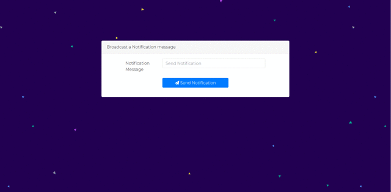

## Send push notifications to your browser with Adonis.js and Pusher channels.

 

## Getting Started
Make sure you have `npm` and `yarn` on your local machine

1.  Clone this repository and cd into it
2.  Run `yarn` or `npm install` to download dependencies
3.  Set up your [pusher account](https://dashboard.pusher.com/accounts/sign_up)
4.  Execute `adonis serve --dev` to run the project in your browser
5.  See the [tutorial](https://pusher.com/tutorials/push-notifications-adonis) for useful notes 

### Prerequisites

* Adonis
* npm or Yarn
* Pusher account

## Built With

* [Pusher channels](https://pusher.com/channels) - Pusher Channels
* [Adonis](https://adonisjs.com/) - Beautiful Php framework
* [Bootstrap](https://getbootstrap.com) - A beautiful Css framework

##Acknowledgments

[Christian Nwamba tutorial](https://pusher.com/tutorials/adonis-realtime) - Inspiring and useful article
